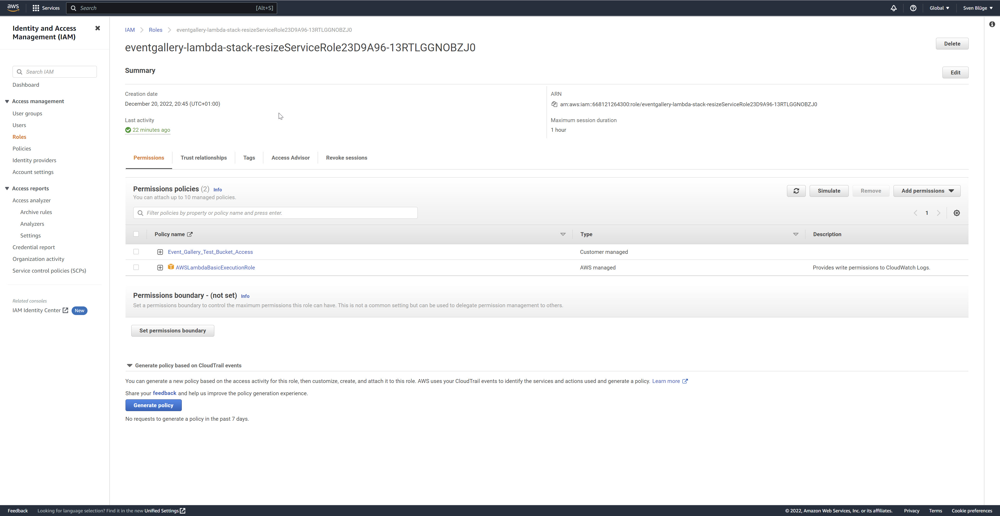

# Event Gallery Image Resize Lambda

This lambda allows resizing of images stored an S3 buckets. Instead of letting your local server calculating images, you can calculate them with a Lambda function. Two buckets are necessary: one containing the original files and one bucket containing the generated thumbnails. 

This Lambda adds ImageMagick as a layer to provide the necessary binaries. Everything necessary to deploy and execute the Lambda is provided with the cdk stack. 


## Necessary Tools

To run&deploy this project, you need the following tools installed.

- AWS CLI -> https://awscli.amazonaws.com/AWSCLIV2.msi
- AWS SAM -> https://github.com/aws/aws-sam-cli
- Docker -> https://www.docker.com/products/docker-desktop/

## Setup, Test & Deploy

    npm install

## Run & Deploy

Running the bootstrapping is only necessary once. 

    npx aws-cdk synth
    npx aws-cdk bootstrap
    npx aws-cdk deploy

### S3 Permissions

The Lambda needs access to two S3 buckets. CDK creates a role for the Lambda automatically. Assign a policy to grant access to S3.  


Here is an example for the policy to access S3 data: 
```
{
    "Version": "2012-10-17",
    "Statement": [
        {
            "Effect": "Allow",
            "Action": [
                "s3:ListBucket"
            ],
            "Resource": [
                "arn:aws:s3:::eventgallery-images-eu-test-original",
                "arn:aws:s3:::eventgallery-images-eu-test-resized"
            ]
        },
        {
            "Effect": "Allow",
            "Action": [
                "s3:PutObject",
                "s3:PutObjectAcl",
                "s3:GetObject",
                "s3:DeleteObject"
            ],
            "Resource": [
                "arn:aws:s3:::eventgallery-images-eu-test-original/*",
                "arn:aws:s3:::eventgallery-images-eu-test-resized/*"
            ]
        }
    ]
}
```

## test locally

Synth and run sam to emulate the stack in a docker container:

    npm run sam

You can run sam and redirect the output to a logfile: 

    sam local start-api -t ./cdk.out/eventgallery-lambda-stack.template.json --output=logfile.txt

In ```test.http``` you'll find some test requests. Using IntelliJ makes executing them easy.

## Pitfalls

The API gateway will return a timeout after 30 seconds. The lambda might need more time and will continue calculating in the background. There are two options to ship around this:

- split your requests into more parts
- provide more memory to the lambda. This will also result in more CPU resources.
